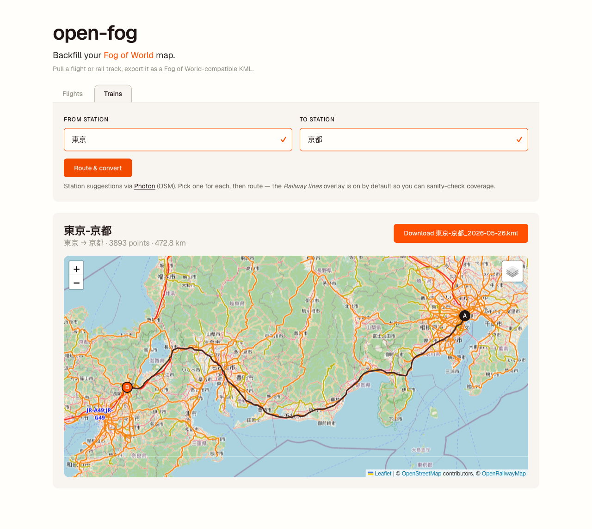

# open-fog

Backfill your [Fog of World](https://fogofworld.com/) map. Pull a flight or rail
track, export it as a Fog of World–compatible KML, drop it into the app to
uncover the tiles.



## What it does

- **Flights** — type a flight number + UTC date, scrape the FR24 history page
  (free tier, last ~7 days), convert the playback to KML.
- **Trains** — search two stations (OSM via [Photon](https://photon.komoot.io/)),
  pick the pins, route along the actual rail right-of-way, export the polyline
  as KML.

Output uses the `gx:Track` shape Fog of World expects — timestamps are present
but ignored by the app (only the path matters for uncovering tiles).

## Run

Requires Go 1.25+.

```sh
go run .                   # listens on :8080
go run . -addr=:9000       # different port
```

Or with [air](https://github.com/air-verse/air) for hot reload:

```sh
air
```

Then open <http://localhost:8080>.

## HTTP API

| Method | Path | Purpose |
| ------ | ---- | ------- |
| `GET` | `/` | Embedded UI |
| `GET` | `/api/candidates?flight=<num>&date=<YYYY-MM-DD>` | List matching FR24 legs |
| `GET` | `/api/track?flightId=<hex>&timestamp=<unix>` | Fetch one playback, convert to KML |
| `GET` | `/api/rail/stations?name=<name>` | OSM station candidates |
| `GET` | `/api/rail?fromLat&fromLon&fromName&toLat&toLon&toName[&date]` | Route between stations, return KML |

The two-step flight flow (`/api/candidates` → `/api/track`) lets the UI
disambiguate when one flight number flies multiple legs the same day.

## Acknowledgments

- Flight history: [FlightRadar24](https://www.flightradar24.com/)
- Station search: [Photon](https://photon.komoot.io/)
- Rail geometry + map tiles: [OpenStreetMap](https://www.openstreetmap.org/)
  contributors, [OpenRailwayMap](https://www.openrailwaymap.org/)
- Map rendering: [Leaflet](https://leafletjs.com/)
